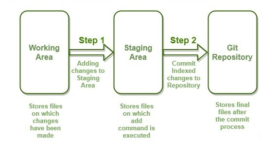
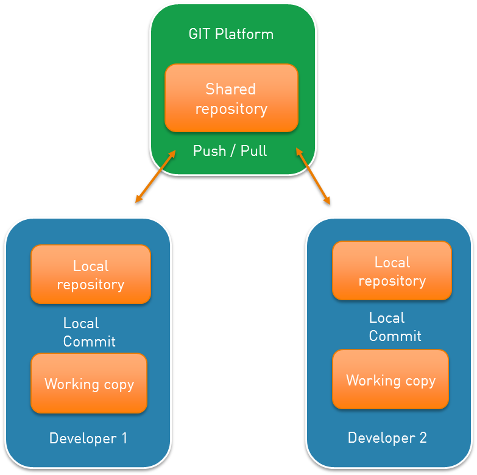

<h1 align="center"> GIT Introduction </h1>

### Repository types

There are two types of repositories in Git

#### 1. Local Repository

+ The local repository is own local machine which we have direct access.

It consists of three stages 

a. **Working area** - In this stage,the files are not handled by git and these files are also referred to as "untracked files".   
It is where we can add new content or modify/delete content in file. 
	
b. **Staging area** - The files in this stage will soon be commited. Git knows what is going to change between the current commit and the next one.  
	
c. **Commited file** - We can commit our changes in order to add version control to the project.

	

#### 2. Remote Repository

+ Remote repository is centralized server and it is optional. Data can be pushed to remote server after got commited.
+ As servers are centralized, Teammates can initilize their own local repository and pull/push  the data from/to server.
+ In order to keep local and remote repository in sync, can pull the changes from remote server to local repository.
+ Data can be retrieve from Remote repository, if local system got crashed or unavailable.
	

### Some of the git commands

| Command | Description |
|------|-------|
| git init | Initialises a Git repository in that directory|
| git config user.name "username" | setting up user name for Git |
| git config user.email "email address" | setting up email address |
| git add file_name | the files moves to the staging area and which will soon to be commited|
| git commit -m <message> | to commit the file with meaningful message so that other user can understand |
| git log | Shows a log of past commits information with commit-id author, date and time commit, commit messages etc |
| git log --oneline |  shows the commit with commit-id and commit messages |
| git log --name-only |  shows the log  of past commits with file name |
| git log --max-count 3 or git log -n 3 | lists the last 3 commits |
| git status | Shows status, including what branch you are on and what changes are staged |
| git restore file_name | discard changes in working area|
| git restore --stages file_name | to move back to working area from staging area |
| git rm --cached file_name |  move back to working area from staging area |
| git rm --f file_name | force delete the file from staging area |

+ .gitignore  - this file contains the file_name which should be ignored
+ echo ".gitignore" >> .gitignore - this command makes .gitignore file should be ignored.

### Labs

1. Install Git - Installation, checking version and basic git operations.
2. Initialize git repository - Initilizing git repository, commiting, checking current status and logs.