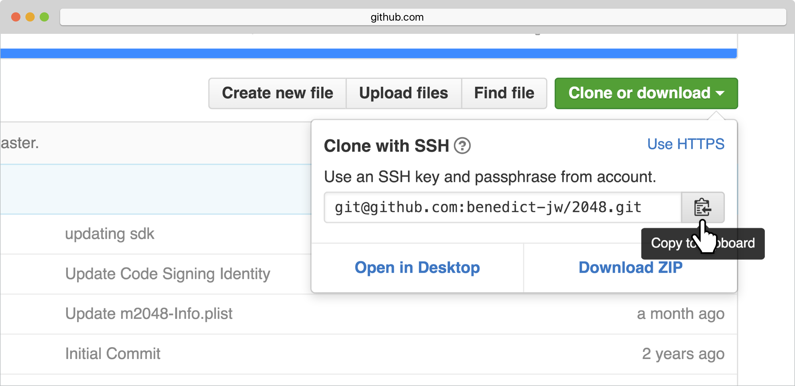
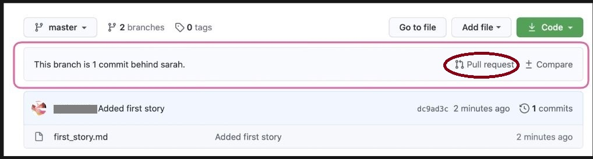

<h1 align="center"> Initialize Remote Repositories </h1>

Images used in this file are downloaded from internet. These are used only for learning purpose.

### Connection of Remote Repository

Remote repository is centralized server and it is optional. Data can be pushed to remote server after got commited. 
We can push code to this remote repository that is hosted somewhere else and get this code again in local machines. 

We can connect the remote repository using connection string. It is a URL that we can use in order to let Git know where the remote repository is located.

+ git remote add origin <URL> - to connect the remote repository from local directory.
+ git remote -v - to list all remote repository
+ git push origin master - to push data to remote repository, Here origin is alias of remote repository and master is branch.

### Cloning of Remote repository

User having access remote repository can clone the repository in order to get all the data to local machines.

+ git clone <ssh link> - to clone the remote repository, where ssh link is the URL of the remote repository.

### Pull Request

When Team member created and pushed the data to branches in Remote repository.  
We can to merge these branches with master  using **Pull Request**

#### Steps to be followed to merge branch  with master file in remote repository.

1. git push origin <branch_name> - which pushes the data to branches in remote repository. 
2. login to remote repository and it shows "This branch is 1 commit to <branch_name>
3. In order to merge <branch_name> with master, we need to click on the pull request.

4. We can add the reviewers, labels and description.
5. Once pull request is done, other team memeber can check the changes.
6. Lastly, can merge with master by clicking on merge pull request.

 
 ### Fetching and Merging
 
 When data in <branch_name> were merged with master file in remote repository.  
 Local repository is not aware of changes hence we need to make it synch with remote repository
 
 + git fetch origin master - to update the origin master branch in local repository
 + gir merge origin/master - to merge origin master with local master
 + git pull origin master - to fetch the origin master branch and merge origin master with local master.
 
### Merge conflict
 
When two of team members are working on files with same name and one of the team member commit the change in master.  
It shows others as merge conflict while commiting. 

During a conflict,Git shows the current context of conflicting files as well as the contents that trying to merge.  
It can resolved by simply removing unwanted lines. and then save the file.

Now, we can add the file and merge with master without any error messages.

### Fork

If we want to work in one of the open-source project from Github but if we dont have write permission to it.  
We can fork Git repository, It creates its own copy of original project, Where we can do the changes and test.  
Then, we can send the pull request to merge with original repository to reviewer of the project.

### Labs

1. Remote Repository - connection, push the data, deletion of repository
2. Cloning remote repository - cloning, check commits etc.
3. Pull Request - creating the pull request, assigning the reviewer, merge pull request etc.
4. Fetching and Merging - fetching, merging origin master with local master, pull the data from remote repository etc.
5. Merge conflicts - merge conflict, data pulling, changes in file and merging .
6. Fork - Forking, sending pull request. merging etc.