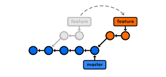
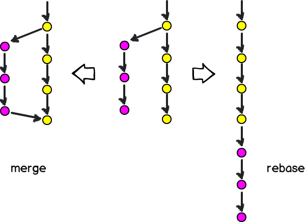
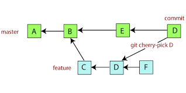

<h1 align="center"> Rebasing </h1>

Images used in this file are downloaded from internet. These are used only for learning purpose.

### Rebasing

When Team is working several branches from master. After somes time one of the team member is merged his branches with master.  
Meanwhile, the other team member wants to rebase his branches with master, which was updated with latest changes. we can do this by using rebasing.

+ git rebase master -  Reapply commits on top of another(master branch) base tip.

During the rebase the commit hash id will get updated. In other words we are modifying Git history when we are rebasing.

 We can rebase the Git history of multiple commits by using interactive Rebasing
 
 + git rebase -i Head~<no.of commits> - modifying the git history of multiple commits, Where no.of commits is number of lastest commits
 
 This command will open a file where we need to need specify how we need to change pick to squash the commits  
 so that the commits will go under the commits and the commit saved as default will remain tip of the commits
 
 
 When we want to pick commit of some other branches to current working branch as an copy, we can use cherry picking

+ git cherry-picking <commit-hash> - to copy the commit onto the branch, where commit-hash is hash id of commit that we are using current branch.
 

### Labs

1. Rebasing - Rebasing the commits, interactive rebasing for multiple commits etc.
2. Checking picking - Rebasing, Interactive rebasing, copy the commits from other branch using cherry-picking etc.
