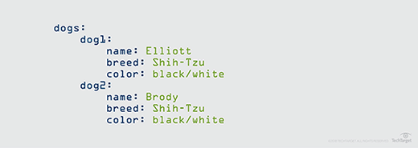
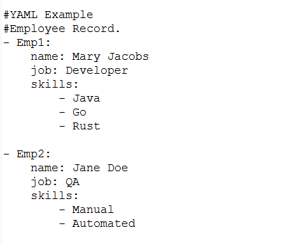
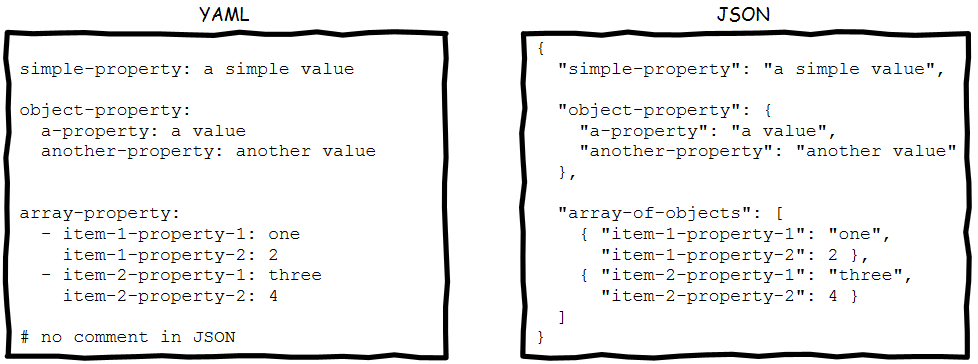

<h1 align="center"> JSON Path </h1>

These notes have prepared based on [JSON PATH](https://beta.kodekloud.com/lessons/lesson-14/).<br /> 

### YAML

YAML is a data serialization language that is often utilized to create configuration files.

#### Key-Value pair 
In this structure, key and values are separated by colon and there should be a space between colon and values

Eg:
```yaml
Fruit: Mango
Vegetable: Tomato
Liquid: Water
Meat: Chicken
```

#### Array-List
Here each item starts with **-** , Where - indicates it is element in an array.

Eg:
```yaml
Fruits:
- Apple
- Orange
- Grapes

Vgetables:
- Potato
- Tomato
- Onion
```

#### Dictionary
It is set of property grouped together under item and each property of the items start with a space.

Eg:
```yaml
Banana:
  Calories: 105
  Fat: 0.4g
  Carbs: 27g

Grapes:
  Calories: 62
  Fat: 0.3g
  Carbs: 16g
```

Note: The spaces for each property should be equal, else an extra space indicates the property of that property.

+ **Dictionary of dictionaries** 

Eg:



+ **List of dictionaries********

Eg:



### Difference between YAML and JSON

|YAML|JSON|
|----|-----|
|Comments are denoted with a hash sign.| Comments are not allowed. |
| Hierarchy is denoted by using double space. <br /> Tab characters are not allowed.|	Objects and Arrays are denoted in braces and brackets. <br /> (Dictionary in **{** and list in **[** |
|String quotes are optional but it supports single and double quotes.	| Strings must be in double quotes. |
|Root node can be any of the valid data types. | Root node must either be an array or an object. |



### JSON PATH

It is query language that can be help to parse data represnted in json.

+ Root node ($): This symbol denotes the root member of a JSON structure and all jsonpath query start with **$**.

+ .property - Selects the specified property in a parent object.

Eg:
```json
{
  "store": {
    "book": [
      {
        "category": "reference",
        "author": "Nigel Rees",
        "title": "Sayings of the Century",
        "price": 8.95
      },
      {
        "category": "fiction",
        "author": "Herman Melville",
        "title": "Moby Dick",
        "isbn": "0-553-21311-3",
        "price": 8.99
      },
      {
        "category": "fiction",
        "author": "J.R.R. Tolkien",
        "title": "The Lord of the Rings",
        "isbn": "0-395-19395-8",
        "price": 22.99
      }
    ],
    "bicycle": {
      "color": "red",
      "price": 19.95
    }
  },
  "expensive": 10
}
```
If we want to get all books in the store, we can use the below command <br />
$.store.book

+ ['property'] - Which lists all the element under property name

Eg:
```json
{
  "store": {
    "book": [
      {
        "category": "reference",
        "author": "Nigel Rees",
        "title": "Sayings of the Century",
        "price": 8.95
      },
      {
        "category": "fiction",
        "author": "Herman Melville",
        "title": "Moby Dick",
        "isbn": "0-553-21311-3",
        "price": 8.99
      },
      {
        "category": "fiction",
        "author": "J.R.R. Tolkien",
        "title": "The Lord of the Rings",
        "isbn": "0-395-19395-8",
        "price": 22.99
      }
    ],
    "bicycle": {
      "color": "red",
      "price": 19.95
    }
  },
  "expensive": 10
}
```
If we want to display all author under book in store, we can use the below command <br />
$.store.book["author"]

+ [index1,index2,…] - Selects array elements with the specified indexes. Returns a list.

+ [start:end] [start:] - Selects array elements from the start index and up to, but not including end index. <br />
 If end is omitted, selects all elements from start until the end of the array. Returns a list.<br />
Eg:
```json
{
  "store": {
    "book": [
      {
        "category": "reference",
        "author": "Nigel Rees",
        "title": "Sayings of the Century",
        "price": 8.95
      },
      {
        "category": "fiction",
        "author": "Herman Melville",
        "title": "Moby Dick",
        "isbn": "0-553-21311-3",
        "price": 8.99
      },
      {
        "category": "fiction",
        "author": "J.R.R. Tolkien",
        "title": "The Lord of the Rings",
        "isbn": "0-395-19395-8",
        "price": 22.99
      }
    ],
    "bicycle": {
      "color": "red",
      "price": 19.95
    }
  },
  "expensive": 10
}
```
If we want to get information about 1st and 3rd book under store <br />
$.store.books[0,3]

+ [:n] - Selects the first n elements of the array. Returns a list.

+ [-n:] - Selects the last n elements of the array. Returns a list.

+ [?(expression)] - Filter expression. Selects all elements in an object or array that match the specified filter. Returns a list.
Eg:
```json
{
  "store": {
    "book": [
      {
        "category": "reference",
        "author": "Nigel Rees",
        "title": "Sayings of the Century",
        "price": 8.95
      },
      {
        "category": "fiction",
        "author": "Herman Melville",
        "title": "Moby Dick",
        "isbn": "0-553-21311-3",
        "price": 8.99
      },
      {
        "category": "fiction",
        "author": "J.R.R. Tolkien",
        "title": "The Lord of the Rings",
        "isbn": "0-395-19395-8",
        "price": 22.99
      }
    ],
    "bicycle": {
      "color": "red",
      "price": 19.95
    }
  },
  "expensive": 10
}
```
If we want to list the title of the book, where price is less than 9 <br />
$.store.book[?( @.price < 9)].title

we can use the following operators to make filter expression.

|Operator	|Description|
|------|-------|
| == |Equals to. String values must be enclosed in single quotes: [?(@.color=='red')].<br /> Note: Number to string comparison works differently depending on the playback engine. In TestEngine, 1 does not equal '1'. In ReadyAPI 1.9 and earlier, 1 equals '1'.|
|!= |	Not equal to. String values must be enclosed in single quotes: [?(@.color!='red')].|
| > |	Greater than. |
| >= |	Greater than or equal to. |
| <	| Less than.|
| <= | 	Less than or equal to.|
| && |Logical AND, used to combine multiple filter expressions: <br/>[?(@.category=='fiction' && @.price < 10)]|
|\|\|| Logical OR, used to combine multiple filter expressions:<br />[?(@.category=='fiction' || @.price < 10)] |
| in	 | Checks if the left-side value is present in the right-side list. |
| nin	 | Checks that the left-side value is not present in the right-side list. String comparison is case-sensitive.|

+ Current node (@): Which list the all the element under current node

+ Wildcard (*): Expresses all elements on the specific node. Eg book[*].author indicates all authors inside a book array.

### JSON PATH Use case - Kubernates

+ Kube control utilies to view infomation about Nodes, PODS, Deployments, ReplicaSets etc. 
+ When we run kubectl command it is interact with kubeapi through kubeapiserver and it return information in json format.
+ kubectl get nodes - to get information about nodes
+ kubectl get pods - to get information about pods

#### How to JSON PATH in KubeClt

steps to be followed:

* Identify the Kubectl command (Eg: to get information about node use command **kubectl get nodes** )
* Familiarize with output (Eg: to get information about pods in json format **kubectl get pods -o json**)
* Form the JSON path query to get required information from the generated json file.
* Use the JSON PATH query with kubectl command. <br />
Eg: kubectl get pods -o =jsonpath= '{ $.items[0].container.[0].image }' <br />
In this example, we need to get a image of container from a json, which was retrieved from a kubeapiserver <br />
Note: the json path should be enclosed with single quotes and { brackets.

### Labs

1. Yaml - Creation of List, Dictionary, List of dictionaries and Dictionary of dictionaries etc.
2. Json Path - queries related list and dictionaries
3. JSON wildcard - queries related customizing the list and dictionaries using wildcards and current node.
4. JSON List - queries related lists by indexing and operators method
5. JSON PATH in Kubenetes - quiz on jason path in kubernetes.

